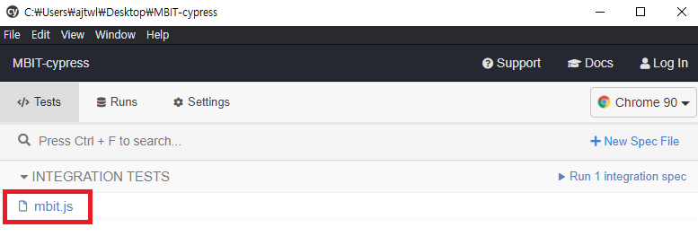

# README

## Requirements

### OS

- **macOS** 10.9 and above *(64-bit only)*
- **Linux** Ubuntu 12.04 and above, Fedora 21 and Debian 8 *(64-bit only)*
- **Windows** 7 and above

### Node

- **Node.js** 12 or 14 and above
- 

## Cypress 설치

```
$ npm install cypress --save-dev
```

## 실행

```shell
$ npx cypress open
```

다소 시간 소요됨



mbit.js 선택 시 테스트 진행